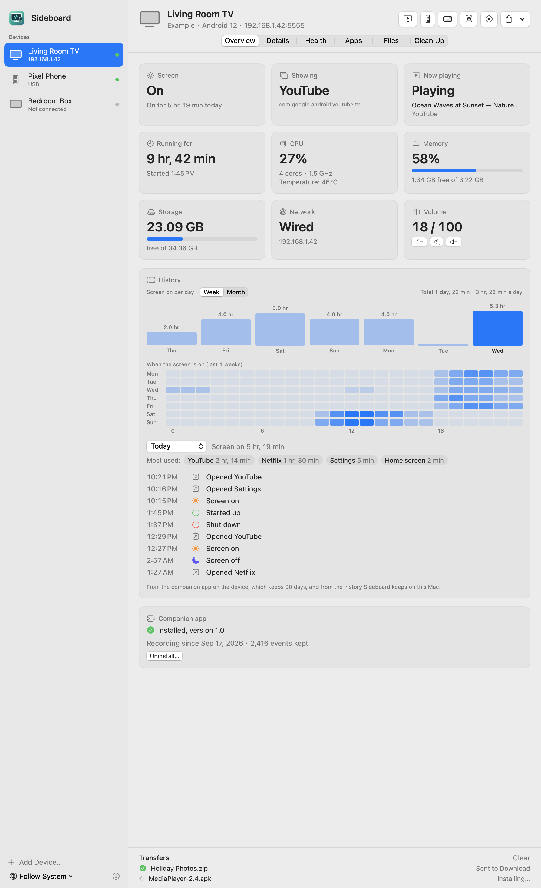
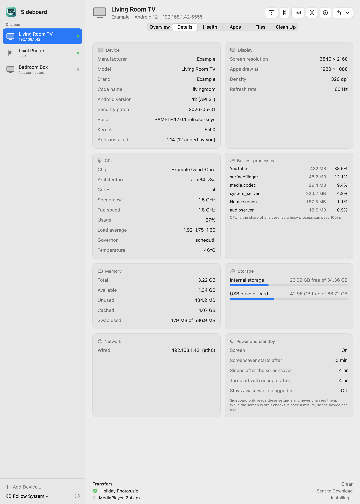
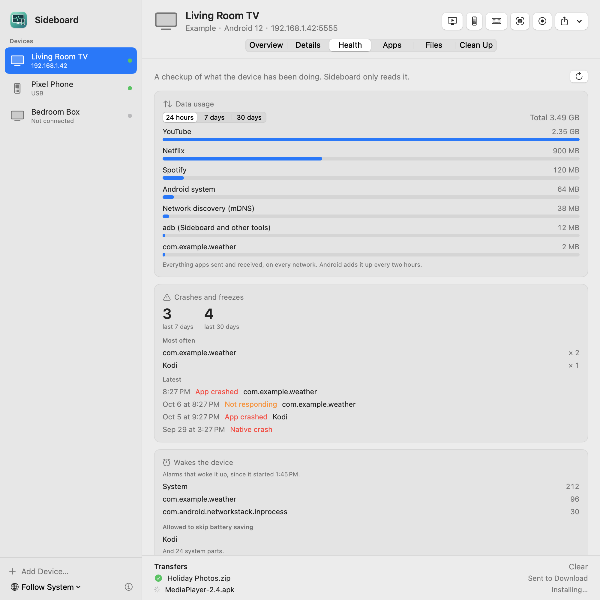
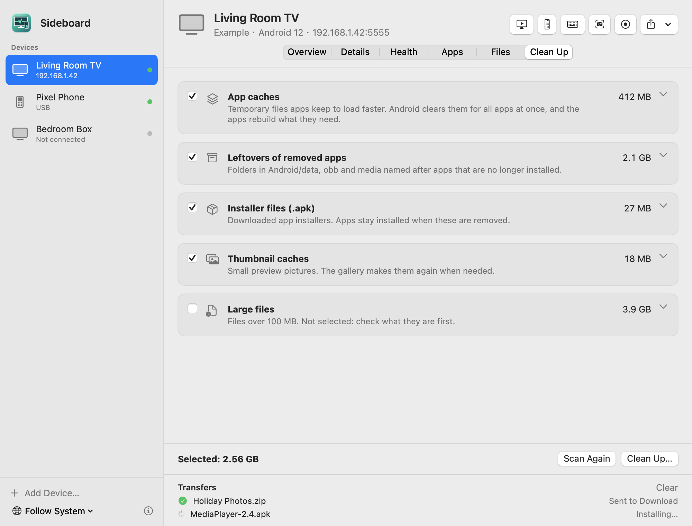

<p align="center"></p>

# Sideboard

**English** · [简体中文](README.zh-CN.md)

See how your Android devices are doing, from your Mac. Sideboard connects to Android TVs,
boxes, phones and tablets over adb, by USB or over your home network, and shows everything
it can read: whether the screen is on, what's showing, what's playing, how long it's been
running, CPU, memory, storage, network, temperature, and the last 24 hours of screen and
app use. It shows the screen live, manages apps and files, cleans up junk, works as a remote,
takes screenshots and recordings, and installs apps.

Nothing has to be installed on the device. An optional companion app adds months of
history, app names and icons, and typing in any language.

<p align="center">
  
</p>

> **Status: early preview (0.6).** Shows your devices' screens live, watches them from the menu
> bar with notifications, keeps their history on your Mac, gives them a health checkup, manages
> apps and files, cleans up, and types in any language with the optional companion app.

## What it shows

**Overview**
- Screen: on, off (standby on TVs), screensaver; how long it's been on today
- The app in front, and what's playing (with the title, or the TV input)
- Running time since it was switched on
- CPU usage, cores and speed; temperature, if the device reports one (many TVs don't)
- Memory and storage, wired or Wi-Fi network and IP address, volume, battery

**Last 24 hours**
- When it was switched on and off, when the screen went on and off, and which apps were
  opened, with today's most-used apps. This comes from Android's own usage history, so it
  covers the time Sideboard wasn't open, too.

**Details**
- Model, Android version and security patch, build, kernel, chip, architecture
- Screen resolution, the resolution apps draw at, density, refresh rate
- CPU speed, load average, the busiest processes
- Memory in detail, internal storage and USB drives or cards
- Wi-Fi network, signal, link speed and band
- Power settings: when the screensaver starts, when it sleeps, when it turns off with no
  input, whether it stays awake while plugged in. Shown only, never changed.
- How many apps are installed, and how many you added

<p align="center">
  
</p>

## In the menu bar, with notifications

Turn on **Run in the background with a menu bar icon** (Settings) and closing the window keeps
Sideboard watching: the menu bar panel shows every device at a glance, and you get a
notification when a device is

- still on late at night (from an hour you pick),
- on for many hours in a row (off by default),
- almost out of storage, running hot or low on battery,
- getting apps installed or removed,
- no longer answering while its screen was on (off by default).

It looks in every 5 minutes while a screen is on and every 30 while it's off, and does nothing
that keeps the devices awake. **Open at login** starts it quietly in the menu bar.

## History on your Mac

Every reading adds to a history Sideboard keeps on your Mac (one small file per device, in
~/Library/Application Support/Sideboard, never uploaded; delete it from Settings). So the
history grows well past Android's 24 hours, even without the companion app, as long as
Sideboard looks in once a day. The Overview shows screen time per day for a week or a month,
with the total and the daily average, and once there are four weeks, when the screen tends to
be on, by weekday and hour.

## Health checkup

The **Health** page reads what the device has been doing:

- **Data usage** per app over 24 hours, 7 days or 30 days (Android's own counters).
- **Crashes and freezes**: how many in the last week and month, which apps, the latest ones.
- **What wakes the device** and which apps run **background jobs**, plus the apps allowed to
  skip battery saving.

<p align="center">
  
</p>

## Apps, files and cleanup

**Apps**: everything installed, with version, last update and size; filter by apps you
added, preinstalled ones and ones that are turned off. Open, force stop, turn off (and back
on), uninstall apps you added, and save any app's APK to your Mac. Apps the device needs to
work (the home screen, the keyboard, core parts of Android) can't be turned off or removed
from Sideboard.

**Files**: browse internal storage and USB drives, see folder sizes, download files and
folders to your Mac, upload (or drop files on the window), create folders, rename and
delete. Deleting asks first: there's no Trash on the device.

**Clean up**: scan for app caches (cleared by Android itself and rebuilt by the apps),
leftover folders of apps that are gone, downloaded installers and thumbnail caches. Large
files are listed for you to check but never selected for you. Nothing is removed until you
choose what and confirm.

<p align="center">
  
</p>

## The companion app (optional)

Everything above works over adb alone. The small companion app (about 120 KB, source in
[`android/`](android/)) adds what adb can't do. Install it from the Overview page; Sideboard
installs it over adb and allows the one permission it needs (usage access), so you don't have
to find it in Settings with a remote.

- **90 days of history**: power on and off, screen on and off, and apps opened, recorded even
  while your Mac is off. The Overview shows screen time per day for the last week; pick any
  day to see what happened.
- **App names and icons** on the Apps page and everywhere else.
- **Type text in any language** and use the device's **clipboard** from your Mac (the keyboard
  button). While the typing window is open, the device uses the companion's keyboard, which
  shows nothing on screen; closing the window switches back to the device's own keyboard.

It runs no background service: a scheduled job copies Android's own usage history a few
times a day, which takes a moment. It doesn't ask for internet access, changes no settings,
and only the adb shell can read what it keeps. Uninstalling it (Overview page) removes it and
its history.

<p align="center">
  
</p>

## What it does (only when you click)

- **Live screen**: the device's screen in a window on your Mac, streamed by Android's own
  `screenrecord` straight over adb, so nothing is installed or written on the device. Click to
  tap, drag to swipe, scroll, right-click for Back; arrow keys, Return and Esc work as the D-pad.
  A new picture comes whenever something on screen changes, usually within a fraction of a
  second. There's no sound, and HDMI inputs and protected video show black.
- **Remote**: D-pad, OK, Back, Home, volume, play/pause, sleep and wake. Arrow keys,
  Return, Esc and Space work too.
- **Screenshot**: the picture comes straight to your Mac and is saved in Pictures →
  Sideboard. Nothing is written on the device.
- **Screen recording**: up to 3 minutes per recording, no sound (Android's own limit). The
  video is saved in Movies → Sideboard and the temporary file on the device is deleted. It only
  records what Android draws: HDMI inputs and protected video come out black, and the video
  only advances while something on screen changes.
- **Send files**: drop files on the window (or use Send) and they go into the device's
  Download folder.
- **Install apps**: drop an `.apk` and it's installed or updated.
- **Open links**: drop a link from Safari on the window, use Send → Open a Link on the
  Device, or select a link in any app and choose Services → **Open on Android Device**.
- **Live typing** (with the companion app): every letter you type goes straight to the
  device, in any language, with Return, Delete and the arrow keys.

## Light on your devices

- Sideboard only reads. It never changes a setting on the device, standby included.
- While the window is open and the screen is on, it reads every 5 seconds. While the
  screen is off, it checks once a minute whether it came back on, so the device can rest.
  With the window closed, it reads nothing.
- The Details page samples processes only while it's open.
- The live screen streams only while its window can be seen, and the recorder on the device
  ends as soon as the window closes.
- Network devices are reconnected once a minute when they're off the network, which
  doesn't wake them.
- Nothing leaves your Mac: no accounts, no analytics. Screenshots in this README use
  made-up data.

## Getting started

1. **Install adb** (Google's Android platform-tools). With Homebrew:

   ```bash
   brew install --cask android-platform-tools
   ```

   Or [download platform-tools](https://developer.android.com/tools/releases/platform-tools)
   and unzip it into `~/Library/Android/sdk/platform-tools`.

2. **Turn on debugging on the device.** Open Settings → About (on TVs: Settings → System →
   About) and click Build number seven times. Then in Developer options turn on USB
   debugging, and for a network connection also Network debugging (TVs and boxes) or
   Wireless debugging (phones and tablets, Android 11 and later).

3. **Connect it.** Plug it in by USB, or click **Add Device…** and enter its IP address, or
   scan your network. The first time, the device asks whether to allow this Mac: tick
   "Always allow" and confirm.

If a network device won't connect although everything looks right, click **Restart adb**:
an adb server started by another app (such as Terminal) may not be allowed onto the local
network.

## Install

Releases aren't published yet. For now, build from source.

Requires macOS 14 Sonoma or later, on Apple silicon or Intel.

## Build from source

Requires Xcode (the Command Line Tools alone lack SwiftUI's macro plugins).

```bash
./build.sh             # builds build.noindex/Sideboard.app (universal)
./build.sh --install   # also copies it to /Applications
./build.sh --dmg       # also makes a .dmg for a release
python3 tools/check_localizations.py   # checks every translation
```

For bug reports, `Sideboard.app/Contents/MacOS/Sideboard --status` prints what Sideboard
reads from each connected device, without serial numbers, addresses or network names.
`--watch` runs the device list and dashboards for 20 seconds and prints what they saw.
`--check` runs the background monitor once with every notification on and prints what it would
send.
`--snapshot <folder>` renders the window in every language, light and dark, with made-up
devices.

The companion app is bundled as `Resources/SideboardCompanion.apk`. To rebuild it you need
Android Studio and the Android SDK: `tools/build-companion.sh` (see [android/README.md](android/README.md)).

## Languages

English, 简体中文, 繁體中文, 日本語, Русский, Español, हिन्दी — switch any time from the
globe menu in the window, no restart needed.

Translations other than English and Chinese would love a review from native speakers.
See [CONTRIBUTING.md](CONTRIBUTING.md).

## Roadmap

- [x] Companion app on the device (optional): 90 days of history, typing in any language,
      clipboard, app names and icons (0.3)
- [x] Apps: list, uninstall, turn off preinstalled apps (reversibly) (0.2)
- [x] Files and cleanup (0.2)
- [x] Menu bar mode and notifications, history on the Mac, health checkup (0.4)
- [x] Screen recording (0.5)
- [x] Live screen view (0.6)
- [ ] Update reminders for open-source apps; export an app list to set up a new device

## Support Sideboard

Sideboard is free and always will be. If it makes looking after your devices easier, you
can buy the developer a coffee — WeChat Pay or Alipay in China, PayPal anywhere. Thank you!

<p align="center">
  
  
  
</p>

## Contact

Bugs and ideas: [open an issue](../../issues). Email: zhaoweijia1997@gmail.com

## License

[MIT](LICENSE)
