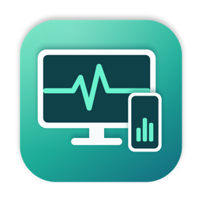
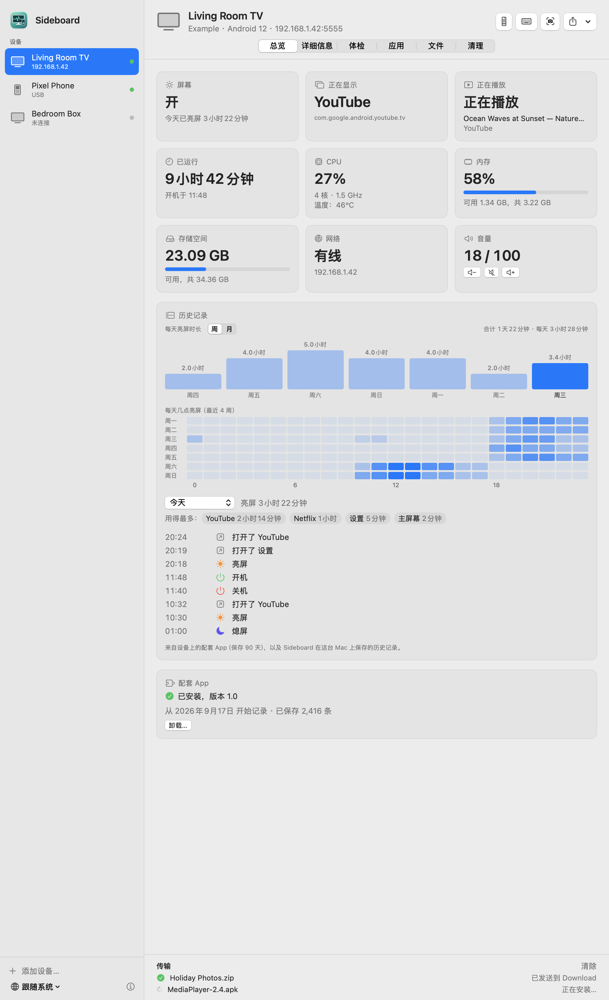
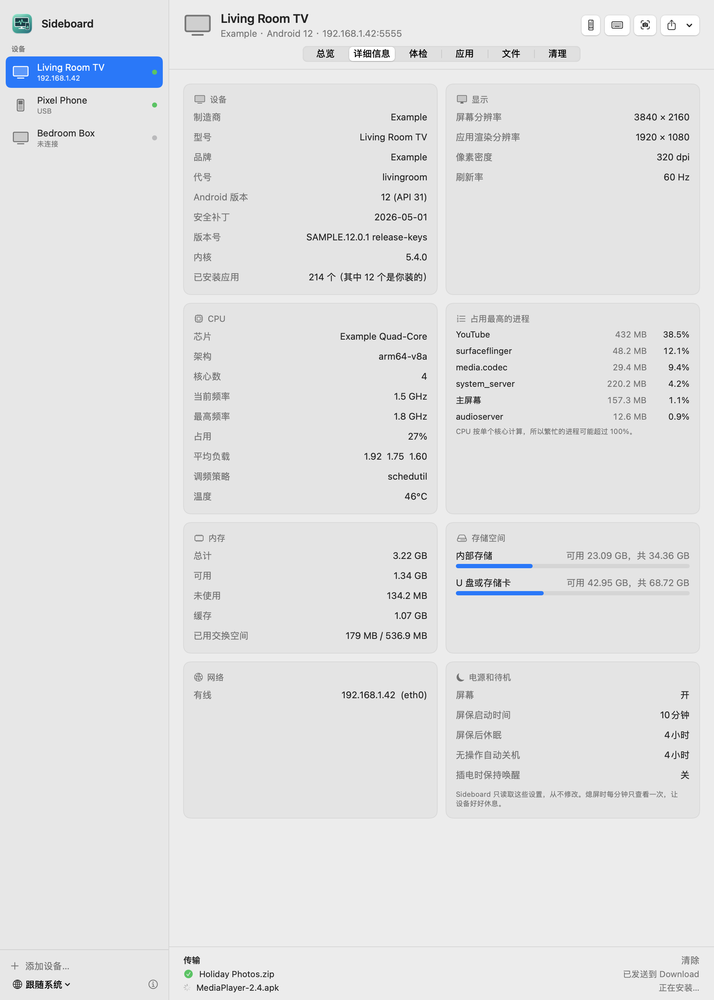
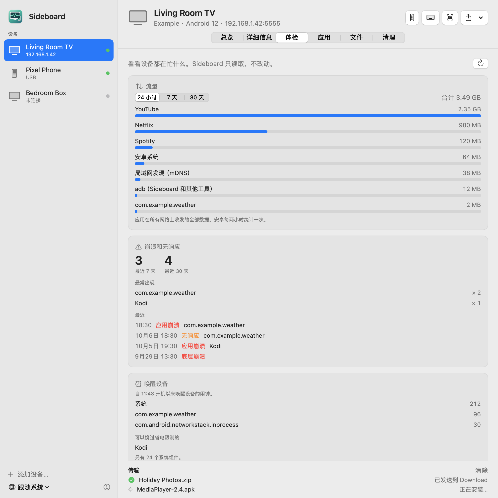
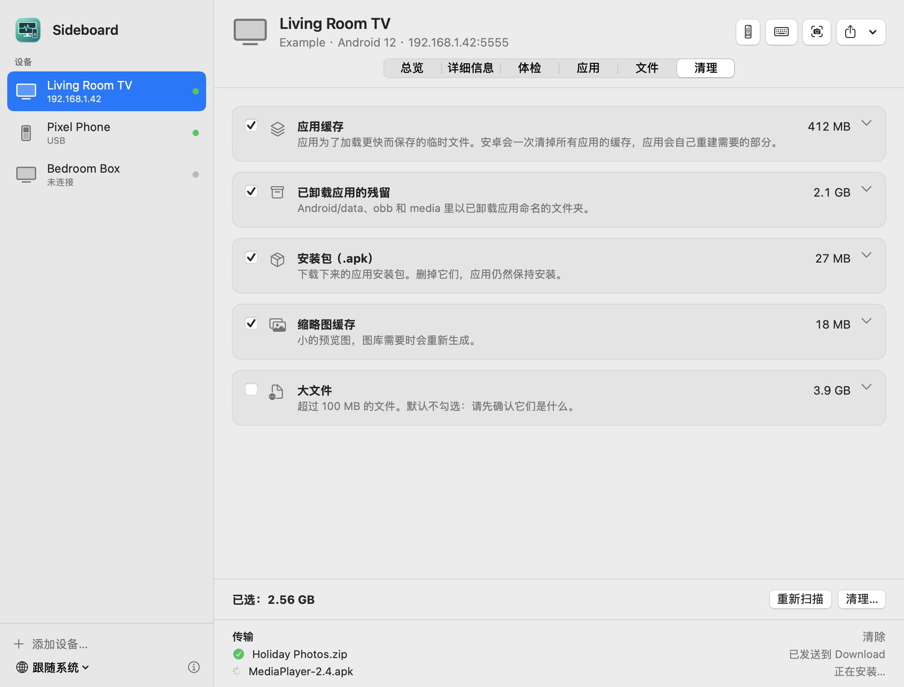

<p align="center"></p>

# Sideboard

[English](README.md) · **简体中文**

在 Mac 上看看你的安卓设备都在干什么。Sideboard 通过 adb 连接安卓电视、盒子、手机和平板，
用 USB 线或家里的网络都行，把能读到的都显示出来：屏幕开没开、正在显示什么、正在播放什么、
开机多久了、CPU、内存、存储、网络、温度，以及最近 24 小时的亮屏、熄屏和使用记录。
它还能管理 App 和文件、清理垃圾、当遥控器、截屏、装 App。

设备上不需要安装任何东西。可选的配套 App 能多出几个月的记录、App 名称和图标，以及任意语言的输入。

<p align="center">
  
</p>

> **状态：早期预览版（0.4）。** 能在菜单栏里照看设备并发通知，把历史记录存在 Mac 上，给设备做体检，管理 App 和文件、清理垃圾；装上可选的配套 App 还能输入任何语言。

## 能看到什么

**总览**
- 屏幕：开、关（电视上是待机）、屏保；今天亮屏了多久
- 前台的 App，以及正在播放的内容（标题，或电视的信号源）
- 开机后运行了多久
- CPU 占用、核心数和频率；温度（如果设备提供的话，很多电视不提供）
- 内存和存储空间，有线还是 Wi-Fi、IP 地址，音量，电池

**最近 24 小时**
- 什么时候开机、关机，什么时候亮屏、熄屏，打开过哪些 App，以及今天用得最多的 App。
  数据来自安卓系统自己的使用记录，所以 Sideboard 没打开的时候发生的事也看得到。

**详细信息**
- 型号、Android 版本和安全补丁、版本号、内核、芯片、架构
- 屏幕分辨率、应用实际渲染的分辨率、像素密度、刷新率
- CPU 频率、平均负载、占用最高的进程
- 内存明细，内部存储和 U 盘/存储卡
- Wi-Fi 网络、信号、连接速率和频段
- 电源设置：多久进屏保、多久休眠、多久无操作自动关机、插电时是否保持唤醒。只显示，从不修改。
- 装了多少个 App，其中多少个是你自己装的

<p align="center">
  
</p>

## 菜单栏常驻和通知

在设置里打开“在后台运行，并在菜单栏显示图标”，关掉窗口后 Sideboard 会继续照看设备：菜单栏面板里一眼看到每台设备的状态，设备出现以下情况时会发通知：

- 深夜还开着（从你选的时间开始算）；
- 连续亮屏很久（默认关闭）；
- 存储空间快满、发热、电量低；
- 有应用被安装或卸载；
- 亮屏时突然失去响应（默认关闭）。

亮屏时每 5 分钟看一次，熄屏时每 30 分钟一次，不做任何让设备睡不着的事。“登录时打开”会让它开机后安静地待在菜单栏里。

## 历史记录存在 Mac 上

每次读取都会把记录存进 Mac 上的历史库（每台设备一个小文件，在 ~/Library/Application Support/Sideboard，不上传；可以在设置里删除）。所以只要 Sideboard 每天至少看一次，不装配套 App 也能攒下远超 24 小时的记录。总览页可以按周或按月看每天的亮屏时长、合计和日均；攒满四周后，还有一张“每天几点亮屏”的热力图（星期 × 小时）。

## 设备体检

“体检”页读出设备最近都在干什么：

- **流量**：每个应用在 24 小时、7 天、30 天里用了多少（来自安卓自己的统计）。
- **崩溃和无响应**：最近一周、一个月各有多少次，是哪些应用，最近几次是什么时候。
- **谁在唤醒设备**、哪些应用在跑**后台任务**，以及哪些应用可以绕过省电限制。

<p align="center">
  
</p>

## App、文件和清理

**App**：列出装了的所有 App，带版本、更新时间和大小；可以按“你装的”“预装”“已停用”筛选。
能打开、强行停止、停用（随时能恢复）、卸载你自己装的 App，还能把任何 App 的 APK 存到 Mac。
设备离不开的 App（主屏幕、输入法、安卓核心组件），Sideboard 不提供停用或删除。

**文件**：浏览内部存储和 U 盘，看文件夹大小，把文件和文件夹下载到 Mac，上传（或者直接拖到窗口上），
新建文件夹、重命名、删除。删除前会先确认：设备上没有废纸篓。

**清理**：扫描应用缓存（由安卓自己清理，应用会自动重建）、已卸载应用留下的文件夹、下载的安装包和缩略图缓存。
大文件只列出来给你检查，不会替你勾选。在你选好并确认之前，什么都不会删。

<p align="center">
  
</p>

## 配套 App（可选）

上面所有功能只靠 adb 就能用。小小的配套 App（约 120 KB，源码在 [`android/`](android/)）补上 adb 做不到的事。
在“总览”页点一下就能装：Sideboard 通过 adb 安装它，并开好它唯一需要的权限（使用情况访问权限），不用拿遥控器去设置里找。

- **90 天的记录**：开机、关机、亮屏、熄屏和打开过的 App，Mac 关着的时候也在记。“总览”页显示最近一周每天的亮屏时长，选任意一天就能看那天发生了什么。
- **App 的名称和图标**，在“应用”页和其他地方都能看到。
- **从 Mac 输入任何语言的文字**，以及读写设备的**剪贴板**（键盘按钮）。输入窗口开着的时候，设备用的是配套 App 的键盘，屏幕上不显示任何东西；关掉窗口就切回设备自己的键盘。

它没有常驻后台的服务：一个定时任务每天几次把安卓自己的使用记录拷过来，每次只要一瞬间。它不申请联网权限，不改任何设置，保存的记录只有 adb 能读。
在“总览”页卸载它，就会连同记录一起删掉。

<p align="center">
  
</p>

## 能做什么（只在你点的时候）

- **遥控器**：方向键、确定、返回、主屏幕、音量、播放/暂停、休眠和唤醒。也可以用键盘的方向键、回车、Esc 和空格。
- **截屏**：图片直接传到 Mac，存在“图片 → Sideboard”里，设备上不留任何文件。
- **传文件**：把文件拖到窗口上（或者点“发送”），会放进设备的 Download 文件夹。
- **装 App**：拖进一个 `.apk`，就会安装或更新。
- **打开链接**：把 Safari 里的链接拖到窗口上，或者点“发送 → 在设备上打开链接”，也可以在任何 App 里选中链接，右键选“服务 → 在安卓设备上打开”。
- **实时输入**（需要配套 App）：在 Mac 上打一个字，设备上就出一个字，任何语言都行，回车、删除、方向键也能用。

## 不折腾设备

- Sideboard 只读取，从不修改设备上的任何设置，包括待机设置。
- 窗口开着、屏幕亮着的时候每 5 秒读一次；熄屏时每分钟只看一次它有没有亮起来，让设备好好休息。窗口关了就什么都不读。
- “详细信息”页只在打开时才统计进程。
- 网络设备不在线时每分钟尝试重连一次，不会把它唤醒。
- 数据不离开你的 Mac：没有账号，没有统计。本说明里的截图用的都是虚构数据。

## 开始使用

1. **安装 adb**（Google 的 Android platform-tools）。用 Homebrew：

   ```bash
   brew install --cask android-platform-tools
   ```

   或者[下载 platform-tools](https://developer.android.com/tools/releases/platform-tools)，
   解压到 `~/Library/Android/sdk/platform-tools`。

2. **在设备上打开调试。** 打开“设置 → 关于”（电视上是“设置 → 系统 → 关于”），连续点按“版本号”七次。
   然后在开发者选项里打开“USB 调试”；要通过网络连接，还要打开“网络调试”（电视和盒子）
   或“无线调试”（手机和平板，Android 11 及以上）。

3. **连接。** 插上 USB 线；或者点“添加设备…”输入它的 IP 地址，也可以扫描整个网络。
   第一次连接时设备会询问是否允许这台 Mac 调试：勾选“一律允许”，再确认。

如果网络设备一切正常却连不上，点“重启 adb”：由其他程序（比如终端）启动的 adb 服务可能没有访问本地网络的权限。

## 安装

暂时还没有发布安装包，目前请从源码编译。

需要 macOS 14 Sonoma 或更新版本，Apple 芯片和 Intel 都可以。

## 从源码编译

需要 Xcode（只装命令行工具缺少 SwiftUI 的宏插件）。

```bash
./build.sh             # 编译出 build.noindex/Sideboard.app（通用版）
./build.sh --install   # 同时拷贝到 /Applications
./build.sh --dmg       # 同时制作发布用的 .dmg
python3 tools/check_localizations.py   # 检查所有翻译
```

反馈问题时，`Sideboard.app/Contents/MacOS/Sideboard --status` 会打印 Sideboard 从每台已连接设备读到的内容，
不含序列号、地址和网络名称。`--watch` 会像窗口一样运行设备列表和仪表盘 20 秒，并打印看到的内容。
`--check` 会打开所有通知、让后台监控跑一轮，打印它会发哪些通知（不真的发）。
`--snapshot <文件夹>` 用虚构的设备，把窗口在每种语言、浅色和深色下各渲染一张图。

配套 App 以 `Resources/SideboardCompanion.apk` 的形式打包进来。重新编译需要 Android Studio 和 Android SDK：`tools/build-companion.sh`（见 [android/README.md](android/README.md)）。

## 语言

English、简体中文、繁體中文、日本語、Русский、Español、हिन्दी —— 随时在窗口里的地球图标菜单切换，不用重启。

英文和中文以外的翻译欢迎母语者帮忙校对，见 [CONTRIBUTING.md](CONTRIBUTING.md)。

## 路线图

- [x] 设备端配套 App（可选）：90 天的记录、输入任意语言、剪贴板、App 名称和图标（0.3）
- [x] App 管理：列出、卸载、停用预装 App（可恢复）（0.2）
- [x] 文件管理和清理（0.2）
- [x] 菜单栏模式和通知、Mac 上的历史记录、设备体检（0.4）
- [ ] 实时画面和录屏
- [ ] 开源应用的更新提醒；导出应用清单，一键装到新设备

## 支持 Sideboard

Sideboard 永远免费。如果它让你照看设备更省心，可以请开发者喝杯咖啡——国内可以用微信或支付宝，海外可以用 PayPal。谢谢！

<p align="center">
  
  
  
</p>

## 联系

问题和建议：[提交 issue](../../issues)。邮箱：zhaoweijia1997@gmail.com

## 许可证

[MIT](LICENSE)
